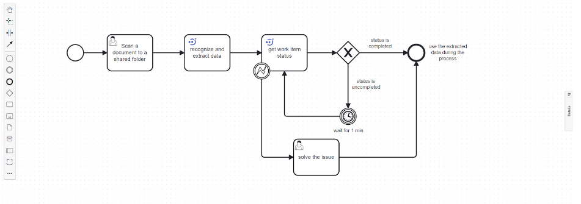
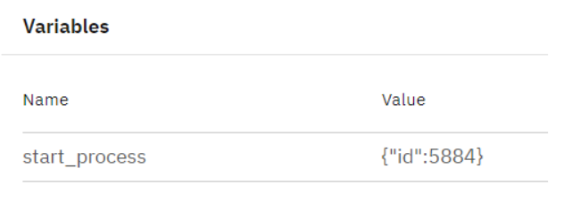
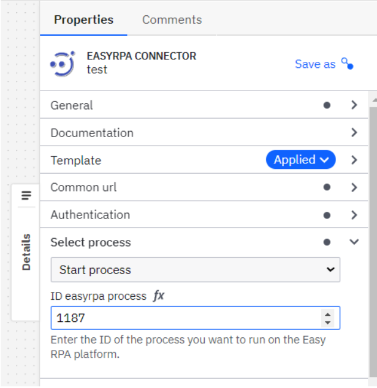

# EasyRPA connector
The  EasyRPA Connector allows you to initiate a robot from your BPMN process with the EasyRPA platform. EasyRPA is an implementation-first Robotic Process Automation platform, designed for the development, deployment, running, and monitoring of modern software robots.
The EasyRPA Connector can be used for performing various kind of operations from your BPMN process: automate human tasks, document recognition, data conversion and data verification, data extraction, including web forms, desktop applications, SAP applications, Java and Oracle Forms applications, and Citrix / Remote Desktop, auto Generation of documents and more.

To start using the Connector, you must have a running  EasyRPA instance. Refer to the official documentation page to learn more about how to install and configure the EasyRPA API platform.
Authentication​
In flow Control server API external client has to be registered and is to be authenticated by so-called 'client secret', other authentication methods are not supported. You must be authenticated as required:
1. In the User Management UI of the  EasyRPA interface, the administrator should create a new user by generating the user name, password, and access rights to the processes.
2. The next step is for the administrator of  EasyRPA to generate a client secret for the user in the User Management UI . For your own Client Secret go to the user profile menu and choose the API Secret option.  
Depending on your role you can either request your own Client Secret (Developer Role) or Client Secret for other applicable users (Administrator Role). 
3. The call to the  EasyRPA Connector automatically obtains the bearer token, which is used for all further API calls authentication.
Create an  EasyRPA Connector task​
To use an  EasyRPA Connector in your process, either change the type of existing task using the wrench-shaped Change type context menu, or create a new Connector task using the Append Connector context menu. Follow Camunda guide on using Connectors to learn more.

In the properties block “Common URL” set url to Easy RPA platform: https://cs2.easyrpa.eu

In the properties block “Authentication” set required properties in the Input section: client_id, client_secret, that is issued by the administrator of  EasyRPA to the user. 
All these parameters are mandatory for initiation of work of the robot. 
![Authentication!(./assets/image/Authentication.png)
In the section “Output mapping” return data depending on the type of process performed by the robot, that can then be used as variables in the Camunda process.

Example

The Easy RPA Connector supports next operation types in the operation type dropdown list:
1. Start process
2. Get process status
3. Search item in Document Set
4. Search item in Data Store
5. Get item from Data Store

Operation type:

Start process
This operation allows you to create elements in the robot’s work queue. The robot starts the process and in response the robot returns to the Camunda process ID and process status.  
Usage:
Populate the Common URL and  Authentication section as previously described.
Select “Start process” from the Operation dropdown.
In the Operation details section, set “ID EasyRPA process”

As a result of this operation, Camunda transfers the ID of the process running in EasyRPA.

Get process status
This operation gets the status of the process after the robot is finished. In response to the process, the robot returns the ID process and technical status of the finishing process to Camunda (for example: "status": "Completed"). 
This operation allows you to integrate with systems that haven’t an API.

The Automation Process Run can receive the following statuses:
Submitted - transient status received after starting the automation process run, and before the automation process run is sent to the queue. (Might be displayed on the UI for milliseconds).
Queued - received by the automation process immediately after clicking the "Start run", and is active until the necessary node is found. The 'Queued' status describes the state when the automation process gets queued on the Control Server side and is waiting for a free node (one in status Idle) on which it can be executed. The node is searched among non dedicated nodes on Control Server based on the capabilities described in Automation Process Details (Details tab).
Deploying on Node - the automation process runs when it finds the node required for its execution and is assigned to that node.
In Progress - received when the automation process run is executed on the node.
Stopping - transient status responsible for stopping the automation process run. The AP receives the status immediately after clicking the "Stop" icon.
Stopped - the automation process run receives the status when its execution is stopped. It is possible to retry stopped automation processes.
Stopped Idle - the automation process receives the status when nothing happened with the tasks for some time. For example, Human tasks are in the Workspace without changes.
Failed - describes the automation process run that is failed with an error. The details of the error can be found in the "Event Log" of the automation process run.
Completed - indicates the successful completion of the automation process run.

Usage:
Populate the Common URL and  Authentication section as previously described.
Select “Get process status” from the Operation dropdown.
In the Operation details section, set “RunID Easy RPA”

As a result of this operation, the status of the Easy RPA process is passed to Camunda.

Get item from Data Store

Data store- it’s  a table in Database, where information is recorded during the process run by the robots. As a result of this operation, the user receives a link where the saved data from the process is stored.
Usage:
Populate the Common URL and  Authentication section as previously described.
Select “Get item from Data Store” from the Operation dropdown.
In the Operation details section, set “Name of data store”

Response example:

Search item in Data Store
This operation allows you to find specific robot-recognized data in order to further use them as process variables in Camunda.
Usage:
Populate the Common URL and  Authentication section as previously described.
Select “Search item in Data Store” from the Operation dropdown.
In the Operation details section, set “Data store ID” and “File name”

As a result of this operation, Easy RPA returns an array with json files, the names of which contain the search value= file_name. Then the user can work at his discretion.

Search item in Document Set
Document set- a specialized data set that stores documents during robot processing or robot training. Documents, stored in the Document Set, can be viewed, extract data from documents, start a training model.
This operation allows you to retrieve data extracted by the robots in a document set.  This operation looks for the elements of the necessary information with the data extracted from the process. And as a result of Camunda operation json returns with all data of the process. Then the user can use the obtained json for their purposes.
 Usage:
Populate the Common URL and  Authentication section as previously described.
Select “Search item in Document Set” from the Operation dropdown.
In the Operation details section, set “File name”, “Document Set ID” and if you wish- set “Comma separeted columns list to return ''.
Response example:

As a result of this operation, Easy RPA returns an array with json files, the names of which contain the search value= file_name. Then the user can work at his discretion.

